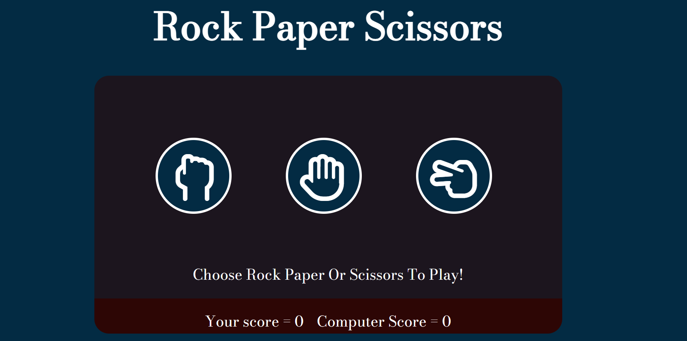
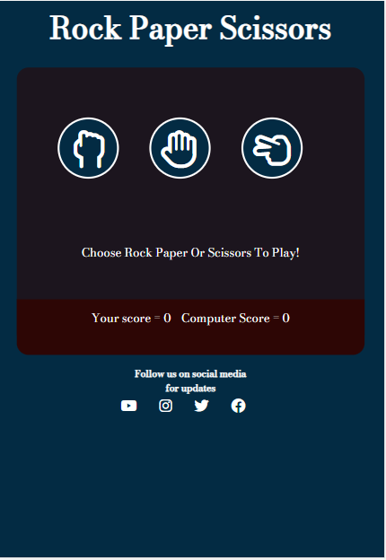
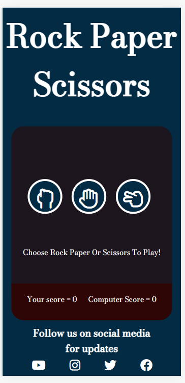

# **Rock Paper Scissors**
Rock Paper Scissors is a simple website that allows the user to play the classical game of rock paper scissors against a computer. The game is entirely randomised when it comes to the computer choice so its not incredibly difficult. 

The user chooses between 3 clickable buttons and gets responsive feedback below with whether he won, he lost, or it was a draw. The game then tracts the score so the user has a sense of accomplishment.

## **Feutures of the Page:**

- **Header**
  - The header has a simple design displaying the name of the game.
  - The header allows the user to quickly recognise the intention of the page and the game.

- **Game Area**
  The game area consists of three major parts. The buttons, the results and the score counter. Each of the areas is easy to see and allows the user responisive feedback about the game itself.
  
  - **Buttons**
    - The buttons are designed to stand out from the rest of the game area as they are the main focus for the user. 
    - The buttons have a hover animation and the cursor changes to a pointer to further encourage clicking the button.
    - The hover transition increases the scale which adds to the focus on the button being pressed.
    - When a button is pressed an Event listnener in JS begins the game function with a value of pressed button.

  - **Instructions/Results**
    - The results text start of an instruction text which tells the player to choose between the three buttons.
    - When the player chooses a button the results are returned to the results text giving the user feedback on whether they won, lost or if it was a draw.
    -  The results text also displays the computers choice so the player does not have a sense of being cheated, or that the game is unfair.

  - **Score Count**
    - The score count tracts the count of every win and loss a player  gets. It keeps a record of it so the player can feel like they have won or lost against the computer.

- **Footer**
  - The footer has social media links and text to follow the social media for updates in regards to the game.
  - This allows the user to suggest updates to the game and also see any changes that occur and any new feautures implemented.

## **Website On Different Screens

  - The game is accessible on all devices with only minor changes to the layout.

- **Computer Screens above 1000pc**

  - The layout for computer screens is the standard layout for the webpage. 

- **Ipad Screens**

  - The layout for the ipad changes a small bit with the game area getting smaller in height and the buttons getting smaller to fit the screen size.

  

- **Mobile Screens**

  - The layout doesn't have many noticeable differences from the ipad layout. The width and height of the game area are adjusted to fit the screens and the buttons are also made smaller.
  
  

  ## **Testing**
 
 ### **Website Functionality Testing**

- **Links Testing**

  - I have tested the four links on my page to social media platforms.
  - They all open as intended in a separate browser page and lead to the correct website.

- **Button Testing**

  - There are three buttons in total on my page: The Rock, Paper and Scissors buttons.
  - All buttons work as intended.

    - The hover transition increases the scale of the buttons without issue.
    - Each button runs the correct function and provides the correct feedback, an example of this is when the player chooses rock and the computer chooses paper, the computer will win.

- **Results Text Testing**
  - The result text works without any issues.
  - The text starts of with prompting the player to chose on of the buttons.
  - The text then changes to the win, lose or it's a draw texts.
  - The text displays the computers choice without a problem on all three results.

 